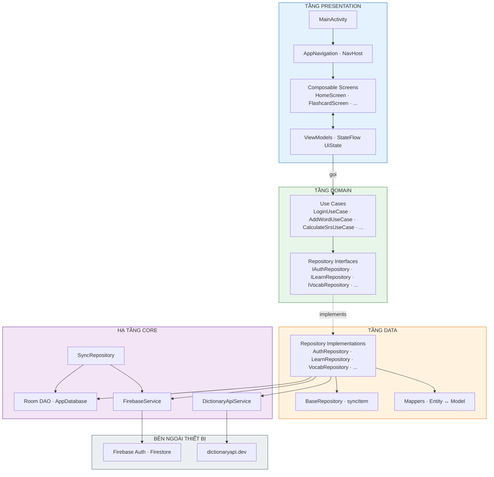
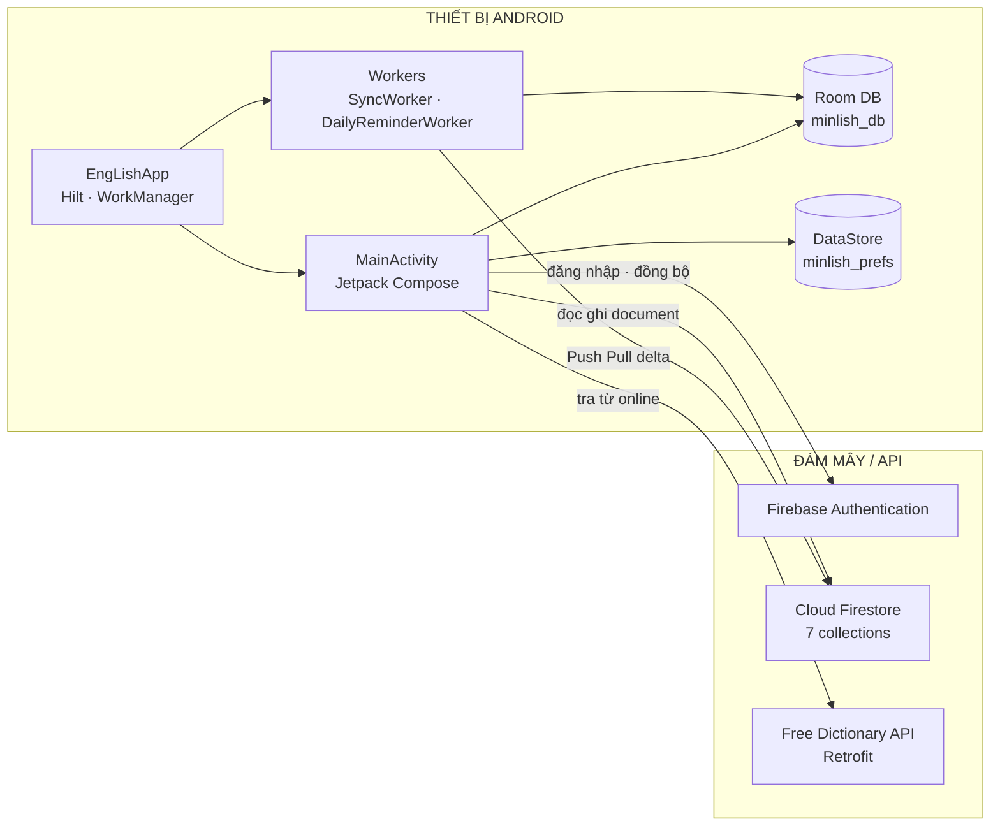
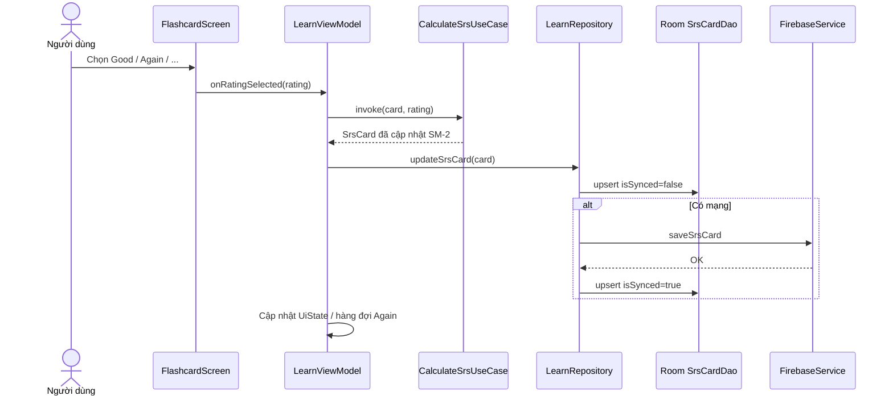
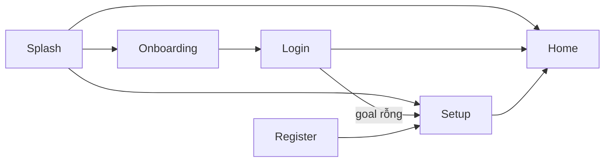
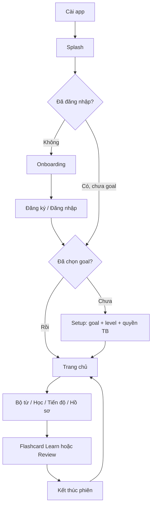
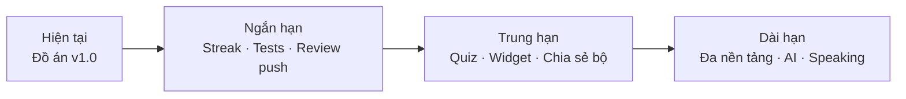

Video Demo: https://www.youtube.com/watch?v=lcwPUA6nrzg

# Báo cáo đồ án — EngLishApp (MinLish)

*Tài liệu gồm Phần 1 (Giới thiệu) · Phần 2 (Thiết kế hệ thống) · Phần 3 (Sản phẩm) · Phần 4 (Tổng kết)*

**Phạm vi:** Package `com.example.englishapp` — **146 file Kotlin**  
**Nền tảng:** Android (minSdk 24, targetSdk 36) · Kotlin · Jetpack Compose  
**Application ID:** `com.example.englishapp`

---

## Mục lục

### [Phần 1 — Giới thiệu](#phần-1--giới-thiệu)

- [1.1 Bối cảnh và mục tiêu dự án](#11-bối-cảnh-và-mục-tiêu-dự-án)
- [1.2 Giới thiệu tổng quan sản phẩm](#12-giới-thiệu-tổng-quan-sản-phẩm)
  - [1.2.1 EngLishApp là gì?](#121-englishapp-là-gì)
  - [1.2.2 Điểm nổi bật so với app ghi chú từ đơn giản](#122-điểm-nổi-bật-so-với-app-ghi-chú-từ-đơn-giản)
- [1.3 Đối tượng người dùng](#13-đối-tượng-người-dùng)
- [1.4 Các chức năng của sản phẩm](#14-các-chức-năng-của-sản-phẩm)
  - [1.4.1 Khởi động và trải nghiệm lần đầu](#141-khởi-động-và-trải-nghiệm-lần-đầu)
  - [1.4.2 Xác thực và hồ sơ](#142-xác-thực-và-hồ-sơ-featuresauth-featuresprofile)
  - [1.4.3 Trang chủ](#143-trang-chủ-featureshome)
  - [1.4.4 Quản lý từ vựng](#144-quản-lý-từ-vựng-featuresvocab)
  - [1.4.5 Học và ôn tập](#145-học-và-ôn-tập-featureslearn)
  - [1.4.6 Tiến độ](#146-tiến-độ-featuresprogress)
  - [1.4.7 Thông báo](#147-thông-báo-featuresnotification)
  - [1.4.8 Hạ tầng chung](#148-hạ-tầng-chung-core)
  - [1.4.9 Sơ đồ chức năng tổng hợp](#149-sơ-đồ-chức-năng-tổng-hợp)
- [1.5 Kiến thức và kỹ năng đã áp dụng](#15-kiến-thức-và-kỹ-năng-đã-áp-dụng)
  - [1.5.1 Lập trình Android hiện đại](#151-lập-trình-android-hiện-đại)
  - [1.5.2 Kiến trúc phần mềm](#152-kiến-trúc-phần-mềm)
  - [1.5.3 Dữ liệu và backend](#153-dữ-liệu-và-backend)
  - [1.5.4 Bất đồng bộ và nền](#154-bất-đồng-bộ-và-nền)
  - [1.5.5 Thuật toán và nghiệp vụ học tập](#155-thuật-toán-và-nghiệp-vụ-học-tập)
  - [1.5.6 Kỹ năng mềm và quy trình](#156-kỹ-năng-mềm-và-quy-trình)
  - [1.5.7 Bảng ánh xạ: môn học → thành phần code](#157-bảng-ánh-xạ-môn-học--thành-phần-code)
- [1.6 Phạm vi và hạn chế](#16-phạm-vi-và-hạn-chế)

### [Phần 2 — Thiết kế hệ thống](#phần-2--thiết-kế-hệ-thống)

- [1. Tổng quan kiến trúc phần mềm](#1-tổng-quan-kiến-trúc-phần-mềm)
  - [1.1 Mô hình kiến trúc lựa chọn](#11-mô-hình-kiến-trúc-lựa-chọn)
  - [1.2 Các tầng logic và trách nhiệm](#12-các-tầng-logic-và-trách-nhiệm)
  - [1.3 Mô hình MVVM trong Presentation](#13-mô-hình-mvvm-trong-presentation)
  - [1.4 Tổ chức theo feature](#14-tổ-chức-theo-feature-feature-based)
  - [1.5 Lớp hạ tầng dùng chung (core)](#15-lớp-hạ-tầng-dùng-chung-core)
  - [1.6 Các nguyên tắc thiết kế then chốt](#16-các-nguyên-tắc-thiết-kế-then-chốt)
  - [1.7 Điểm vào hệ thống](#17-điểm-vào-hệ-thống-entry-points)
  - [1.8 Tóm tắt](#18-tóm-tắt)
- [2. Công nghệ và thành phần hạ tầng](#2-công-nghệ-và-thành-phần-hạ-tầng)
- [3. Sơ đồ kiến trúc tổng thể](#3-sơ-đồ-kiến-trúc-tổng-thể)
  - [3.1 Sơ đồ phân tầng logic](#31-sơ-đồ-phân-tầng-logic-clean-architecture--mvvm)
  - [3.2 Sơ đồ triển khai thiết bị & mạng](#32-sơ-đồ-triển-khai-trên-thiết-bị-và-dịch-vụ-mạng)
  - [3.3 Sequence: Đánh giá flashcard](#33-sơ-đồ-luồng-nghiệp-vụ-tiêu-biểu--đánh-giá-flashcard)
- [4. Luồng dữ liệu và các tầng](#4-luồng-dữ-liệu-và-các-tầng)
  - [4.1 Presentation — Luồng đọc](#41-tầng-presentation--luồng-hiển-thị-read)
  - [4.2 Domain — Xử lý nghiệp vụ](#42-tầng-domain--luồng-xử-lý-nghiệp-vụ)
  - [4.3 Data — Ghi & đồng bộ](#43-tầng-data--luồng-ghi-và-đồng-bộ-write)
  - [4.4 Core — Vai trò](#44-lớp-core--vai-trò-trong-luồng-dữ-liệu)
  - [4.5 Bảng tóm tắt luồng](#45-bảng-tóm-tắt-hướng-luồng-dữ-liệu)
- [5. Cấu trúc thư mục chi tiết](#5-cấu-trúc-thư-mục-chi-tiết)
  - [Gốc package và điều hướng](#gốc-package-và-điều-hướng)
  - [Nhánh core](#nhánh-core--hạ-tầng-dùng-chung)
  - [Nhánh features](#nhánh-features--theo-từng-nghiệp-vụ)
  - [Quy ước đặt tên file](#quy-ước-đặt-tên-file)
  - [Mối quan hệ thư mục ↔ kiến trúc](#mối-quan-hệ-thư-mục-với-kiến-trúc)
- [6. Mô hình dữ liệu và CSDL](#6-mô-hình-dữ-liệu-và-cơ-sở-dữ-liệu)
  - [6.1 Room](#61-room-minlish_db)
  - [6.2 Firestore](#62-firestore-collections)
  - [6.3 SrsCard](#63-srscard)
- [7. Điều hướng (Navigation)](#7-điều-hướng-navigation)
- [8. Các module tính năng](#8-các-module-tính-năng)
- [9. Đồng bộ dữ liệu (Offline-first)](#9-đồng-bộ-dữ-liệu-offline-first)
  - [9.1 Ghi tức thì (syncItem)](#91-ghi-tức-thì-syncitem)
  - [9.2 Đồng bộ toàn phần (syncAll)](#92-đồng-bộ-toàn-phần-syncall)
  - [9.3 Kích hoạt sync](#93-kích-hoạt)
- [10. Các thuật toán (kèm ví dụ)](#10-các-thuật-toán-kèm-ví-dụ-minh-họa)
  - [10.1 SM-2 Spaced Repetition](#101-thuật-toán-sm-2-spaced-repetition)
  - [10.2 Hàng đợi flashcard](#102-hàng-đợi-flashcard-trong-một-phiên-học)
  - [10.3 Delta sync](#103-đồng-bộ-delta-delta-sync)
  - [10.4 CSV parse/export](#104-phân-tích-và-xuất-csv)
  - [10.5 recalculateSetCounts](#105-tính-lại-thống-kê-bộ-từ-recalculatesetcounts)
  - [10.6 CEFR & level progress](#106-cấp-độ-cefr-và-thanh-tiến-độ)
  - [10.7 Hoạt động tuần](#107-hoạt-động-học-trong-tuần)
  - [10.8 Retention theo bộ](#108-retention-tỷ-lệ-thuộc-theo-bộ-từ)
  - [10.9 Lên lịch nhắc học](#109-lên-lịch-nhắc-học-hàng-ngày)
  - [10.10 Routing sau đăng nhập](#1010-điều-hướng-sau-đăng-nhập--splash)
  - [10.11 Thành phần chưa triển khai](#1011-thành-phần-chưa-triển-khai-đầy-đủ)
- [11. Dependency Injection (Hilt)](#11-phụ-thuộc-và-dependency-injection)

### [Phần 3 — Sản phẩm](#phần-3--sản-phẩm)

- [3.1 Tổng quan sản phẩm](#31-tổng-quan-sản-phẩm)
- [3.2 Luồng trải nghiệm người dùng](#32-luồng-trải-nghiệm-người-dùng)
- [3.3 Mô tả chi tiết từng chức năng](#33-mô-tả-chi-tiết-từng-chức-năng)
  - [Khởi động & Onboarding](#331-khởi-động-và-giới-thiệu-onboarding)
  - [Xác thực & thiết lập tài khoản](#332-xác-thực-và-thiết-lập-tài-khoản)
  - [Trang chủ](#333-trang-chủ-home)
  - [Quản lý từ vựng](#334-quản-lý-từ-vựng)
  - [Học flashcard](#335-học-và-ôn-tập-flashcard)
  - [Tiến độ](#336-màn-hình-tiến-độ)
  - [Hồ sơ & cài đặt](#337-hồ-sơ-và-cài-đặt)
  - [Thông báo](#338-thông-báo)
  - [Đồng bộ & offline](#339-đồng-bộ-dữ-liệu-và-hoạt-động-offline)

### [Phần 4 — Tổng kết](#phần-4--tổng-kết)

- [4.1 Tự đánh giá sản phẩm](#41-tự-đánh-giá-sản-phẩm)
- [4.2 So sánh với mục tiêu ban đầu](#42-so-sánh-với-mục-tiêu-ban-đầu)
- [4.3 Hạn chế và rủi ro hiện tại](#43-hạn-chế-và-rủi-ro-hiện-tại)
- [4.4 Hướng phát triển](#44-hướng-phát-triển-sản-phẩm)

---

# Phần 1 — Giới thiệu

## 1.1 Bối cảnh và mục tiêu dự án

Trong bối cảnh học ngoại ngữ trên di động ngày càng phổ biến, người học tiếng Anh cần một công cụ vừa **quản lý từ vựng cá nhân**, vừa **nhắc ôn đúng thời điểm** để ghi nhớ lâu dài — thay vì học dồn một lần rồi quên. Các ứng dụng flashcard thương mại thường gắn với hệ sinh thái đóng hoặc yêu cầu trả phí cho đồng bộ đa thiết bị.

**EngLishApp** (tên hiển thị / thương hiệu nội bộ: **MinLish**) là **ứng dụng Android** do nhóm phát triển nhằm:

- Hỗ trợ người dùng **tự tạo và quản lý bộ từ vựng** theo chủ đề (IELTS, TOEIC, Business, Travel, …).
- Học qua **flashcard** kết hợp thuật toán **Spaced Repetition (SRS)** — ôn lại từ đúng lúc, giảm quên.
- **Đồng bộ dữ liệu** lên đám mây (Firebase) để không mất tiến độ khi đổi máy hoặc cài lại app.
- Theo dõi **tiến độ, streak, mục tiêu hàng ngày** và nhận **thông báo nhắc học**.

Dự án được xây dựng trong khuôn khổ **đồ án / môn Lập trình di động**, tập trung vào kiến trúc phần mềm có thể mở rộng, code Kotlin hiện đại và trải nghiệm người dùng bằng Material Design 3.

---

## 1.2 Giới thiệu tổng quan sản phẩm

### 1.2.1 EngLishApp là gì?

EngLishApp là **ứng dụng học từ vựng tiếng Anh trên Android**, xây dựng theo mô hình **một tài khoản — nhiều bộ từ — nhiều thẻ SRS**:

```
Người dùng
    └── Tài khoản (Firebase Auth + hồ sơ User)
            └── Bộ từ vựng (Vocabulary Set)
                    └── Từ (Word)
                            └── Thẻ SRS (SrsCard) — lịch ôn, trạng thái học
```

**Luồng sử dụng điển hình:**

1. Cài app → Splash → Onboarding (lần đầu) → Đăng ký / Đăng nhập.
2. Thiết lập **mục tiêu** (IELTS, TOEIC, …) và **trình độ** (A1–C2).
3. Vào **Trang chủ**: xem streak, tiến độ hôm nay, bộ từ cần ôn / từ mới.
4. Tạo bộ từ, thêm từ (thủ công, tra từ điển API, hoặc import CSV).
5. **Học** (từ mới) hoặc **Ôn tập** (từ đến hạn) bằng flashcard → đánh giá Again / Hard / Good / Easy.
6. Xem **Tiến độ** (biểu đồ tuần, level CEFR, tỷ lệ thuộc từ).
7. Dữ liệu tự **đồng bộ** khi có mạng; vẫn dùng được offline nhờ Room.

### 1.2.2 Điểm nổi bật so với app ghi chú từ đơn giản

| Khía cạnh | App ghi chú thông thường | EngLishApp |
|-----------|--------------------------|------------|
| Ôn tập | Người dùng tự nhớ lịch | **SM-2 SRS** tự tính `nextReview` |
| Dữ liệu | Chỉ trên máy | **Room + Firestore**, delta sync |
| Học | Danh sách tĩnh | **Flashcard** + hàng đợi “Again” trong phiên |
| Động lực | Không có | **Streak**, mục tiêu ngày, thông báo |
| Tra từ | Copy thủ công | **Free Dictionary API** + điền sẵn form |

---

## 1.3 Đối tượng người dùng

| Nhóm | Nhu cầu | Tính năng hỗ trợ |
|------|---------|------------------|
| Sinh viên ôn IELTS/TOEIC | Bộ từ theo chủ đề, theo dõi tiến độ | Setup goal, Progress, CEFR level |
| Người đi làm | Từ Business, học rảnh trên điện thoại | Offline-first, nhắc hàng ngày |
| Người tự học | Tạo bộ từ riêng, import CSV | My Sets, Import/Export |
| Người mới bắt đầu | Giao diện hướng dẫn, onboarding | Onboarding, Setup level A1–C2 |

---

## 1.4 Các chức năng của sản phẩm

Dưới đây là **toàn bộ nhóm chức năng** đã triển khai trong mã nguồn, nhóm theo module để dễ tra cứu khi viết báo cáo.

### 1.4.1 Khởi động và trải nghiệm lần đầu

| STT | Chức năng | Mô tả | Màn hình / File liên quan |
|-----|-----------|--------|---------------------------|
| 1 | Splash | Màn chờ, sau đó điều hướng theo trạng thái đăng nhập | `SplashScreen` |
| 2 | Onboarding | Giới thiệu app cho người chưa đăng nhập | `OnboardingScreen` |
| 3 | Điều hướng thông minh | Tự chọn Onboarding / Setup / Home sau Splash | `AuthViewModel.getStartDestination()` |

### 1.4.2 Xác thực và hồ sơ (`features/auth`, `features/profile`)

| STT | Chức năng | Mô tả |
|-----|-----------|--------|
| 4 | Đăng ký email/mật khẩu | Tạo tài khoản Firebase Auth + lưu User |
| 5 | Đăng nhập | Email/password, đồng bộ profile từ Firestore |
| 6 | Đăng nhập Google | `SignInWithGoogleUseCase` + Play Services Auth |
| 7 | Quên mật khẩu | Gửi email reset qua Firebase |
| 8 | Thiết lập ban đầu | Chọn goal (IELTS, TOEIC, Business, Travel, Communication) và level (A1–C2); xin quyền thông báo |
| 9 | Hồ sơ cá nhân | Xem/sửa tên, avatar (Coil load ảnh) |
| 10 | Cài đặt | Giao diện sáng/tối (`ThemeManager`), bật/tắt nhắc |
| 11 | Đổi mật khẩu | Firebase Auth `updatePassword` |
| 12 | Đăng xuất | Xóa session, về màn Login |

### 1.4.3 Trang chủ (`features/home`)

| STT | Chức năng | Mô tả |
|-----|-----------|--------|
| 13 | Dashboard | Tổng quan học tập trong ngày |
| 14 | Streak | Hiển thị số ngày học liên tiếp |
| 15 | Tiến độ ngày | `wordsToday / dailyGoal` — thanh progress có animation |
| 16 | Bộ cần ôn ngay | Danh sách set có thẻ `nextReview <= hiện tại` |
| 17 | Từ mới hôm nay | Set còn thẻ trạng thái `new` |
| 18 | Gần đây | Set vừa có `StudySession` |
| 19 | Bottom navigation | Home · My Sets · Progress · Profile |

### 1.4.4 Quản lý từ vựng (`features/vocab`)

| STT | Chức năng | Mô tả |
|-----|-----------|--------|
| 20 | Danh sách bộ từ | `MySetsScreen` — xem tất cả set của user |
| 21 | Tạo bộ từ | Tên, mô tả, tags |
| 22 | Xóa bộ từ | `DeleteSetUseCase` |
| 23 | Danh sách từ trong bộ | `VocabListScreen` — CRUD từng từ |
| 24 | Thêm/sửa/xóa từ | Tự tạo `SrsCard` khi thêm từ mới |
| 25 | Tìm kiếm từ | Trong bộ theo từ khóa |
| 26 | Tra từ điển online | API `dictionaryapi.dev` — phiên âm, nghĩa, ví dụ |
| 27 | Lưu từ từ điển | Prefill qua `savedStateHandle` về `VocabList` |
| 28 | Import CSV | `ImportCsvUseCase` + `CsvParser` |
| 29 | Export CSV | `ExportCsvUseCase` — chia sẻ file |
| 30 | Thống kê bộ từ | Đếm `new` / `learning` / `mastered` sau mỗi thay đổi |

### 1.4.5 Học và ôn tập (`features/learn`)

| STT | Chức năng | Mô tả |
|-----|-----------|--------|
| 31 | Chế độ Learn | Tối đa **10** thẻ `new` mỗi phiên |
| 32 | Chế độ Review | Thẻ đã học và **đến hạn ôn** |
| 33 | Flashcard | Lật thẻ, hiển thị từ / nghĩa |
| 34 | Đánh giá 4 mức | Again · Hard · Good · Easy → cập nhật SM-2 |
| 35 | Lặp lại trong phiên | Bấm Again → thẻ đưa xuống **cuối hàng đợi** |
| 36 | Kết thúc phiên | `SessionCompleteScreen` — thống kê phiên |
| 37 | Lưu lịch sử phiên | `StudySession`: thời lượng, accuracy, số lần từng rating |

### 1.4.6 Tiến độ (`features/progress`)

| STT | Chức năng | Mô tả |
|-----|-----------|--------|
| 38 | Tổng quan | Streak, tổng từ SRS, accuracy trung bình |
| 39 | Level CEFR | A1 → C2 theo tổng số thẻ |
| 40 | Hoạt động tuần | Biểu đồ T2–CN so với `dailyGoal` |
| 41 | Trạng thái từ | Phân bố new / learning / mastered |
| 42 | Retention theo bộ | % thuộc = mastered / wordCount (tối đa 3 set) |

### 1.4.7 Thông báo (`features/notification`)

| STT | Chức năng | Mô tả |
|-----|-----------|--------|
| 43 | Danh sách thông báo in-app | Đọc / đánh dấu đã đọc |
| 44 | Nhắc học hàng ngày | `DailyReminderWorker` — lên lịch theo giờ user chọn |
| 45 | Kênh thông báo hệ thống | `NotificationHelper` |

### 1.4.8 Hạ tầng chung (`core`)

| STT | Chức năng | Mô tả |
|-----|-----------|--------|
| 46 | Cơ sở dữ liệu local | Room — 7 bảng |
| 47 | Đồng bộ đám mây | Push/Pull Firestore, delta sync |
| 48 | Sync nền | WorkManager — mỗi giờ + khi mở app |
| 49 | Giao diện Material 3 | Theme sáng/tối, typography, màu thương hiệu |
| 50 | Kiểm tra mạng | `NetworkUtil` — quyết định sync ngay hay chờ |

### 1.4.9 Sơ đồ chức năng tổng hợp

```mermaid
flowchart TB
    APP["EngLishApp / MinLish"]

    APP --> ACC["Tài khoản"]
    APP --> VOC["Từ vựng"]
    APP --> LRN["Học tập"]
    APP --> PRG["Theo dõi"]
    APP --> SYS["Hệ thống"]

    ACC --> ACC1["Đăng ký · Đăng nhập"]
    ACC --> ACC2["Đăng nhập Google"]
    ACC --> ACC3["Setup mục tiêu & trình độ"]
    ACC --> ACC4["Hồ sơ · Cài đặt · Đổi MK"]

    VOC --> VOC1["Quản lý bộ từ"]
    VOC --> VOC2["Thêm · Sửa · Xóa từ"]
    VOC --> VOC3["Import · Export CSV"]
    VOC --> VOC4["Tra từ điển API"]

    LRN --> LRN1["Flashcard — Learn"]
    LRN --> LRN2["Flashcard — Review"]
    LRN --> LRN3["Thuật toán SM-2 SRS"]
    LRN --> LRN4["Thống kê phiên học"]

    PRG --> PRG1["Streak"]
    PRG --> PRG2["Tiến độ · Level CEFR"]
    PRG --> PRG3["Biểu đồ hoạt động tuần"]

    SYS --> SYS1["Room — offline"]
    SYS --> SYS2["Firebase — đồng bộ"]
    SYS --> SYS3["Thông báo nhắc học"]
```



---

## 1.5 Kiến thức và kỹ năng đã áp dụng

Phần này liệt kê **kiến thức lý thuyết** và **kỹ năng thực hành** thể hiện trực tiếp trong dự án — phù hợp mục “Kết quả đạt được” / “Kiến thức áp dụng” của báo cáo.

### 1.5.1 Lập trình Android hiện đại

| Kiến thức / Kỹ năng | Áp dụng trong dự án |
|---------------------|---------------------|
| **Kotlin** | Toàn bộ codebase; data class, sealed class, extension, coroutines |
| **Jetpack Compose** | UI khai báo; `State`, `remember`, `LaunchedEffect`, animation |
| **Material Design 3** | `MaterialTheme`, component M3, icon extended |
| **Navigation Compose** | `NavHost`, deep link với `{setId}`, `savedStateHandle` |
| **Single Activity** | Một `MainActivity`, mọi màn là Composable |
| **ViewModel + StateFlow** | Quản lý `UiState`, tách UI và logic |
| **Lifecycle** | `ProcessLifecycleOwner` kích sync khi app lên foreground |

### 1.5.2 Kiến trúc phần mềm

| Kiến thức / Kỹ năng | Áp dụng trong dự án |
|---------------------|---------------------|
| **Clean Architecture** | Tách Presentation / Domain / Data |
| **MVVM** | Screen ↔ ViewModel ↔ UseCase |
| **Repository pattern** | `I*Repository` + implementation |
| **Use Case pattern** | Mỗi nghiệp vụ một class (`AddWordUseCase`, …) |
| **Dependency Injection** | Dagger **Hilt** — `@Module`, `@HiltViewModel`, `@HiltWorker` |
| **Feature-based modularization** | Package `features/auth`, `features/vocab`, … |
| **Offline-first** | Local source of truth (Room), sync khi có mạng |

### 1.5.3 Dữ liệu và backend

| Kiến thức / Kỹ năng | Áp dụng trong dự án |
|---------------------|---------------------|
| **Room Database** | Entity, DAO, `@Query`, `Flow`, TypeConverter |
| **Firebase Authentication** | Email, Google, reset password |
| **Cloud Firestore** | NoSQL document, query `whereGreaterThan` cho delta sync |
| **DataStore Preferences** | Lưu `last_sync_time` theo từng user |
| **REST API (Retrofit)** | Dictionary API, Gson parse JSON |
| **OkHttp** | Logging interceptor, client HTTP |

### 1.5.4 Bất đồng bộ và nền

| Kiến thức / Kỹ năng | Áp dụng trong dự án |
|---------------------|---------------------|
| **Kotlin Coroutines** | `viewModelScope`, `suspend`, `withContext(IO)` |
| **Flow / StateFlow** | UI reactive theo DB; `combine`, `flatMapLatest` |
| **WorkManager** | `PeriodicWorkRequest`, `OneTimeWorkRequest`, retry, constraints |
| **Hilt Worker** | Inject `SyncRepository` vào `SyncWorker` |

### 1.5.5 Thuật toán và nghiệp vụ học tập

| Kiến thức / Kỹ năng | Áp dụng trong dự án |
|---------------------|---------------------|
| **Spaced Repetition (SM-2)** | `CalculateSrsUseCase` — ease factor, interval |
| **Queue trong phiên học** | Xử lý Again ở cuối danh sách flashcard |
| **Delta synchronization** | Chỉ tải bản ghi `updatedAt > lastSync` |
| **Parsing CSV** | State machine cho dấu phẩy trong ngoặc kép |
| **Thống kê / phân loại CEFR** | Map tổng từ → level A1–C2 |

### 1.5.6 Kỹ năng mềm và quy trình

- **Đọc hiểu tài liệu API** (Dictionary API, Firebase).
- **Tổ chức mã nguồn** theo package rõ ràng (~146 file).
- **Xử lý edge case** (ví dụ: không `collect` Flow SRS khi học review để tránh crash index).
- **Kiểm thử** (cấu hình JUnit, MockK, Turbine trong `build.gradle`).

### 1.5.7 Bảng ánh xạ: môn học → thành phần code

| Nội dung thường gặp trong môn Lập trình di động | Minh chứng trong EngLishApp |
|-----------------------------------------------|----------------------------|
| Activity / Fragment | `MainActivity` + Compose (không dùng Fragment cho UI chính) |
| Lưu trữ local | Room `minlish_db` |
| Gọi API | Retrofit `DictionaryApiService` |
| Đăng nhập | Firebase Auth |
| Service / Worker nền | `SyncWorker`, `DailyReminderWorker` |
| Thiết kế UI | Compose + Material 3 + Coil + Lottie |

---

## 1.6 Phạm vi và hạn chế

**Trong phạm vi đồ án:**

- Ứng dụng **chỉ Android** (chưa có iOS/Web).
- Tập trung **từ vựng + flashcard SRS**, chưa có bài nghe/nói/grammar riêng.
- Từ điển dùng API miễn phí (**dictionaryapi.dev**), phụ thuộc mạng khi tra từ.

**Hạn chế kỹ thuật đã ghi nhận trong code:**

- `CheckStreakRiskUseCase`, `ReviewDueWorker` — **chưa triển khai** (class rỗng).
- Cập nhật **streak tự động** khi hoàn thành phiên học — logic đọc streak có, nhưng chưa thấy use case ghi streak đầy đủ trong toàn bộ luồng learn.

---

# Phần 2 — Thiết kế hệ thống

**Phạm vi:** Toàn bộ mã nguồn `com.example.englishapp`  
**Sản phẩm:** Ứng dụng học từ vựng — flashcard, SRS, Firebase, offline-first.

---

## 1. Tổng quan kiến trúc phần mềm

### 1.1 Mô hình kiến trúc lựa chọn

EngLishApp được thiết kế theo **Clean Architecture** (kiến trúc sạch) kết hợp **MVVM** (Model — View — ViewModel) trên nền giao diện khai báo **Jetpack Compose**. Lý do lựa chọn:

- **Tách bạch trách nhiệm:** Giao diện, logic nghiệp vụ và truy cập dữ liệu không trộn lẫn — dễ bảo trì khi đồ án mở rộng thêm tính năng.
- **Khả năng kiểm thử:** Tầng Domain (Use Case) có thể kiểm thử độc lập khi mock `IRepository`.
- **Phù hợp offline-first:** Tầng Data che giấu chi tiết Room/Firebase; ViewModel chỉ gọi Use Case.

Trong thực tế triển khai, các **model dùng chung** (`User`, `Word`, `SrsCard`, …) đặt tại `core/data/model` để mọi feature cùng tham chiếu — đây là cách làm thực dụng phổ biến trên Android, thay vì tách duplicate model ở từng module.

### 1.2 Các tầng logic và trách nhiệm

| Tầng | Thành phần chính | Trách nhiệm | Package tham chiếu |
|------|------------------|-------------|-------------------|
| **Presentation** | `*Screen.kt`, `*ViewModel.kt`, `AppNavigation` | Hiển thị UI; thu sự kiện người dùng; giữ `UiState`; **không** gọi trực tiếp DAO hay Firebase | `features/*/presentation/`, `navigation/` |
| **Domain** | `*UseCase.kt`, `I*Repository.kt` | Quy tắc nghiệp vụ thuần (đăng nhập, thêm từ, tính SRS, import CSV…); định nghĩa **hợp đồng** dữ liệu qua interface | `features/*/domain/` |
| **Data** | `*Repository.kt`, `*Mapper.kt`, `FirebaseService` | Triển khai interface; đọc/ghi Room; gọi Firestore/API; map `Entity` ↔ model | `features/*/data/`, `core/data/` |
| **Hạ tầng (Core)** | `AppDatabase`, DAO, `SyncRepository`, `SyncWorker`, theme, util | Dịch vụ dùng chung toàn app; đồng bộ nền; DI module | `core/` |

**Quy tắc phụ thuộc (Dependency Rule):** Chiều phụ thuộc luôn **hướng vào trong** — Presentation → Domain ← Data. Tầng Domain **không** import class Android UI hay Firebase; chỉ biết `IAuthRepository`, `ILearnRepository`, v.v.

### 1.3 Mô hình MVVM trong Presentation

| Thành phần MVVM | Ứng với EngLishApp | Ví dụ cụ thể |
|-----------------|-------------------|--------------|
| **View** | Composable Screen | `HomeScreen`, `FlashcardScreen` |
| **ViewModel** | `@HiltViewModel` + `StateFlow<UiState>` | `LearnViewModel`, `AuthViewModel` |
| **Model** | Dữ liệu từ Use Case / Repository | `User`, `SrsCard`, `HomeReviewDeck` |

Luồng tương tác chuẩn: người dùng bấm nút trên **View** → **ViewModel** gọi **Use Case** → Use Case gọi **Repository** → cập nhật DB/API → ViewModel cập nhật `UiState` → View **recompose** theo state mới.

### 1.4 Tổ chức theo feature (Feature-based)

Mỗi nghiệp vụ là một **package độc lập** dưới `features/`, gồm tối thiểu ba nhánh `data`, `domain`, `presentation`. Module có đăng ký Hilt riêng (`*Module.kt`) bind interface repository:

| Feature | Repository interface | Ghi chú |
|---------|---------------------|---------|
| `auth` | `IAuthRepository` | Firebase Auth + User local |
| `vocab` | `IVocabRepository`, `IDictionaryRepository` | Bộ từ + API từ điển |
| `learn` | `ILearnRepository` | SRS, phiên học |
| `home` | `IHomeRepository` | Dashboard |
| `progress` | `IProgressRepository` | Thống kê |
| `profile` | `IProfileRepository` | Cài đặt, đổi MK |
| `notification` | `INotificationRepository` | Thông báo in-app |

`splash`, `onboarding` chỉ có **presentation** (màn đơn, không repository riêng).

### 1.5 Lớp hạ tầng dùng chung (`core`)

`core` **không** thay thế tầng Domain, mà cung cấp **nền tảng kỹ thuật**:

- **Lưu trữ:** `AppDatabase`, 7 DAO, 7 Entity, `Converters`.
- **Đồng bộ:** `SyncRepository` (push/pull toàn cục), `SyncWorker` (WorkManager).
- **Tích hợp:** `FirebaseService`, `DictionaryApiClient`.
- **Giao diện chung:** `EngLishAppTheme`, `MainBottomBar`, `ThemeManager`.
- **Tiện ích:** `CsvParser`, `NetworkUtil`, `NotificationHelper`.

### 1.6 Các nguyên tắc thiết kế then chốt

1. **Single Activity**  
   Chỉ `MainActivity` khai báo `setContent { AppNavigation() }`. Mọi màn hình là destination trong `NavHost` — giảm phức tạp vòng đời Activity.

2. **Offline-first (ưu tiên ngoại tuyến)**  
   Mọi thao tác ghi qua `BaseRepository.syncItem`: **Room trước** (`isSynced = false`), Firestore sau nếu có mạng. Người dùng vẫn học flashcard khi mất mạng.

3. **Reactive UI**  
   Danh sách từ, streak, deck gợi ý dùng `Flow` từ Room — UI tự cập nhật khi DB đổi, không cần refresh thủ công.

4. **Dependency Injection tập trung**  
   Dagger **Hilt** (`@HiltAndroidApp`, `@HiltViewModel`, `@HiltWorker`) — không tự `new` Repository trong ViewModel.

5. **Đồng bộ chủ động + nền**  
   `EngLishApp.onCreate`: lịch sync 1 giờ/lần; sync ngay khi mở app; sync lại khi app lên **foreground** (`ProcessLifecycleOwner`).

### 1.7 Điểm vào hệ thống (Entry points)

| Thành phần | File | Vai trò |
|------------|------|---------|
| Application | `EngLishApp.kt` | Khởi tạo Hilt, WorkManager, lên lịch `SyncWorker` |
| Activity | `MainActivity.kt` | Theme sáng/tối, gọi `AppNavigation()` |
| Điều hướng | `AppNavigation.kt` | `NavHost`, 18+ route, truyền `setId` / `mode` |
| Định nghĩa route | `Screen.kt` | Sealed class route string |

### 1.8 Tóm tắt

Kiến trúc EngLishApp là **ứng dụng Android một Activity**, chia **9 nhóm feature** + **core**, mỗi feature tuân **Clean Architecture ba tầng**, Presentation theo **MVVM + Compose**, dữ liệu **Room làm nguồn sự thật local** và **Firestore làm backup/đa thiết bị**, logic học tập nằm ở **Use Case** (đặc biệt `CalculateSrsUseCase` cho SRS).

---

## 2. Công nghệ và thành phần hạ tầng

| Thành phần | Công nghệ / Thư viện |
|------------|----------------------|
| UI | Jetpack Compose, Material 3, Coil, Lottie |
| Điều hướng | Navigation Compose 2.7.7 |
| DI | Dagger Hilt + KSP |
| DB local | Room |
| Backend | Firebase Auth, Firestore, FCM, Analytics |
| API từ điển | Retrofit + OkHttp + Gson |
| Background | WorkManager + Hilt Worker |
| Preferences | DataStore |
| Reactive | Coroutines, Flow, StateFlow |

---

## 3. Sơ đồ kiến trúc tổng thể

Phần này gồm **hai sơ đồ bổ sung** phản ánh đúng mã nguồn: (A) phân tầng logic Clean Architecture, (B) bố trí thành phần vật lý trên thiết bị Android và dịch vụ bên ngoài.

### 3.1 Sơ đồ phân tầng logic (Clean Architecture + MVVM)



**Giải thích sơ đồ 3.1**

Sơ đồ mô tả **chiều phụ thuộc mã nguồn** trong EngLishApp:

- **Tầng Presentation** (khung xanh dương) là nơi người dùng tương tác. `MainActivity` chỉ khởi tạo theme và `AppNavigation`. Mỗi **Screen** Composable nhận callback điều hướng (ví dụ `onLearnClick`) và đọc `uiState` từ **ViewModel** qua `collectAsState()`. ViewModel **không** được phép gọi `wordDao` hay `FirebaseAuth` trực tiếp — mọi thao tác đi qua Use Case.

- **Tầng Domain** (khung xanh lá) chứa **logic nghiệp vụ có tên riêng**. Ví dụ: `CalculateSrsUseCase` nhận `SrsCard` + rating và trả về thẻ đã tính lại `nextReview`; `ImportCsvUseCase` gọi `CsvParser` rồi lặp `AddWordUseCase`. Interface `ILearnRepository` định nghĩa *cần gì* (lấy thẻ đến hạn, cập nhật SRS) mà **không** quan tâm Room hay Firestore lưu thế nào.

- **Tầng Data** (khung cam) **triển khai** các interface Domain. `LearnRepository` kế thừa `BaseRepository`: khi `updateSrsCard`, luôn `upsert` Room trước, sau đó thử `firebaseService.saveSrsCard` nếu `NetworkUtil.isOnline()`. **Mapper** chuyển `SrsCardEntity` ↔ `SrsCard` để tách schema DB khỏi model dùng trong Use Case.

- **Hạ tầng Core** (khung tím) là các dịch vụ **dùng chung nhiều feature**: một `AppDatabase`, một `FirebaseService`, `SyncRepository` cho đồng bộ hàng loạt. Đây không phải “tầng thứ tư” trong Domain thuần túy, mà là **shared infrastructure** trong kiến trúc Android thực tế.

- **Bên ngoài** (khung xám): Firebase và Dictionary API — hệ thống không kiểm soát được, chỉ giao tiếp qua SDK/HTTP.

Đường **nét đứt** `IFACE -.-> REPO` thể hiện quan hệ **implements** (Dependency Inversion): Domain phụ thuộc abstraction, Data cung cấp implementation — đúng nguyên tắc SOLID.

---

### 3.2 Sơ đồ triển khai trên thiết bị và dịch vụ mạng



**Giải thích sơ đồ 3.2**

Sơ đồ thể hiện **vật lý triển khai** — phần nào chạy trên máy, phần nào trên server:

- **`EngLishApp`** là `Application` duy nhất: đăng ký `HiltWorkerFactory`, gọi `SyncWorker.schedule()` (định kỳ 1 giờ) và `SyncWorker.startImmediate()` khi khởi động; lắng nghe lifecycle để sync lại khi user quay lại app.

- **`MainActivity`** và toàn bộ UI nằm trong process app, đọc/ghi **Room** `minlish_db` (7 bảng) và **DataStore** (lưu `last_sync_time_<userId>` phục vụ delta sync).

- **`SyncWorker`** và **`DailyReminderWorker`** chạy nền qua **WorkManager** — không gắn với một màn hình cụ thể. `SyncWorker` inject `SyncRepository` để push bản ghi `isSynced = false` rồi pull thay đổi từ Firestore.

- **Firebase Auth** xác thực; **Firestore** lưu trữ document song song với Room (users, vocabulary_sets, words, srs_cards, study_sessions, streaks, notifications).

- **Dictionary API** chỉ dùng khi user tra từ trong `DictionaryScreen` — không lưu toàn bộ từ điển local.

Hai sơ đồ 3.1 và 3.2 **bổ sung cho nhau**: 3.1 trả lời “lớp code nào gọi lớp nào”; 3.2 trả lời “dữ liệu nằm ở đâu trên máy và trên cloud”.

---

### 3.3 Sơ đồ luồng nghiệp vụ tiêu biểu — Đánh giá flashcard



**Giải thích sơ đồ 3.3**

Đây là **chuỗi thao tác chính xác** khi học flashcard — dùng để minh họa trong báo cáo cách các tầng phối hợp: UI chỉ gửi sự kiện; thuật toán SM-2 nằm trong Use Case; Repository chịu trách nhiệm persistence và sync tức thì; `SyncWorker` chỉ xử lý các bản ghi còn sót `isSynced = false` nếu bước Firebase thất bại.

---

## 4. Luồng dữ liệu và các tầng

Mục này mô tả **cách dữ liệu di chuyển** giữa các tầng khi **đọc** (hiển thị) và khi **ghi** (thay đổi), kèm ví dụ thực tế từ mã nguồn.

### 4.1 Tầng Presentation — Luồng hiển thị (Read)

**Thành phần:** Composable Screen, ViewModel, `StateFlow<UiState>`.

**Cơ chế:**

1. ViewModel trong `init` hoặc `LaunchedEffect` gọi Use Case / observe Repository.
2. Repository trả về `Flow<List<...>>` từ Room DAO.
3. ViewModel `collect` Flow và `update` vào `_uiState`.
4. Screen `val uiState by viewModel.uiState.collectAsState()` → Compose vẽ lại khi state đổi.

**Ví dụ — `HomeScreen` hiển thị bộ từ cần ôn:**

```
HomeScreen
  → HomeViewModel (collect uiState)
    → GetHomeDecksUseCase / HomeRepository.getReviewDecks(userId)
      → srsCardDao.getDueCountPerSet() + vocabularySetDao.observeSetsByIds()
        → Flow phát danh sách HomeReviewDeck
  → UI render card "Cần ôn ngay"
```

**Nguyên tắc:** Screen **stateless** theo nghĩa không giữ business logic; chỉ format dữ liệu để hiển thị (ví dụ `progress = wordsToday / wordGoal` vẫn có thể tính trên UI hoặc ViewModel).

**Điều hướng:** `AppNavigation` truyền lambda `onLearnClick = { navController.navigate(...) }` — Presentation điều phối màn hình, không điều phối dữ liệu domain.

---

### 4.2 Tầng Domain — Luồng xử lý nghiệp vụ

**Thành phần:** Use Case (`operator fun invoke`), interface Repository.

**Trách nhiệm:**

- Gom nhiều bước thành **một hành động có nghĩa** với người dùng.
- Không biết Android Context, không biết SQL.

**Ví dụ 1 — `AddWordUseCase`:**

| Bước | Hành động |
|------|-----------|
| 1 | Gán `wordId` UUID nếu trống |
| 2 | `repository.insertOrUpdateWord(word)` |
| 3 | Nếu chưa có SRS → tạo `SrsCardEntity` status `new` |
| 4 | `repository.recalculateSetCounts(setId, userId)` |

**Ví dụ 2 — `CalculateSrsUseCase`:**

Nhận thẻ + rating → áp dụng nhánh SM-2 (again/hard/good/easy) → trả `SrsCard` mới với `nextReview` tính bằng mili giây. ViewModel **không** chứa công thức interval.

**Ví dụ 3 — `AuthViewModel.getStartDestination()`:**

Đọc `AuthResult.Success<User>` → quyết định route Onboarding / Setup / Home — logic **điều hướng theo trạng thái user** có thể coi là application rule, đặt ở ViewModel vì gắn trực tiếp Navigation.

---

### 4.3 Tầng Data — Luồng ghi và đồng bộ (Write)

**Hai pattern chính:**

#### Pattern A — Ghi từng mục (`BaseRepository.syncItem`)

Dùng khi user thao tác trực tiếp (thêm từ, cập nhật SRS, lưu session):

```
1. localOp()     → Room insert/update, isSynced = false
2. if (online)   → remoteOp() Firebase
3. onSuccess     → đánh dấu isSynced = true
4. if (offline)  → dữ liệu vẫn trên máy, chờ SyncWorker
```

**Ví dụ:** `LearnRepository.updateSrsCard(card)` sau khi user bấm **Good** trên flashcard.

#### Pattern B — Đồng bộ toàn cục (`SyncRepository.syncAll`)

Dùng bởi `SyncWorker`, không qua ViewModel:

```
Phase 1 PUSH: user, sets, words, srs_cards, sessions, streak, notifications (unsynced)
Phase 2 PULL: query Firestore updatedAt > lastSync → merge Room → cập nhật DataStore
```

**Mapper:** Mọi dữ liệu từ Room ra Domain đi qua `.toDomain()`; ghi vào Room qua `.toEntity()`. Giữ schema DB ổn định khi đổi model UI.

---

### 4.4 Lớp Core — Vai trò trong luồng dữ liệu

| Thành phần Core | Vai trò trong luồng |
|-----------------|---------------------|
| `AppDatabase` | Single source of truth **trên thiết bị** |
| `FirebaseService` | Cổng ghi/đọc Firestore thống nhất, tránh duplicate Firebase code |
| `SyncRepository` | Điều phối sync **đa bảng**, delta theo `updatedAt` |
| `NetworkUtil` | Quyết định có gọi remote ngay hay không |
| `CsvParser` | Biến text CSV → `ParsedWord` trước khi vào Use Case |
| `ThemeManager` | DataStore/Flow — không liên quan nghiệp vụ từ vựng |

**Luồng tra từ điển (đặc thù):**

```
DictionaryScreen → DictionaryViewModel → LookupWordUseCase
  → DictionaryRepository → DictionaryApiService (Retrofit)
    → JSON DictionaryResponse → hiển thị / prefill VocabList qua savedStateHandle
```

Luồng này **không bắt buộc** ghi Firestore ngay — chỉ khi user bấm lưu từ vào bộ thì mới đi qua `AddWordUseCase` + sync.

---

### 4.5 Bảng tóm tắt hướng luồng dữ liệu

| Hành động người dùng | Presentation | Domain | Data / Core |
|----------------------|--------------|--------|-------------|
| Xem Home | HomeViewModel | GetStreakUseCase, … | HomeRepository → DAO Flow |
| Thêm từ | VocabViewModel | AddWordUseCase | VocabRepository + SrsCardDao |
| Học flashcard | LearnViewModel | CalculateSrsUseCase | LearnRepository.syncItem |
| Đăng nhập | AuthViewModel | LoginUseCase | AuthRepository → Firebase + UserDao |
| Mở app (nền) | — | — | SyncWorker → SyncRepository |

---

## 5. Cấu trúc thư mục chi tiết

Toàn bộ mã nguồn nằm dưới `app/src/main/java/com/example/englishapp/`. Cấu trúc dưới đây **khớp với project hiện tại** (146 file Kotlin), nhóm theo vai trò để tra cứu khi viết báo cáo hoặc bảo vệ đồ án.

### Gốc package và điều hướng

```
com.example.englishapp/
├── EngLishApp.kt              # @HiltAndroidApp, WorkManager, lifecycle sync
├── MainActivity.kt            # @AndroidEntryPoint, Compose, ThemeManager
└── navigation/
    ├── AppNavigation.kt       # NavHost — toàn bộ route ứng dụng
    └── Screen.kt              # sealed class định nghĩa route string
```

- **`EngLishApp`:** Điểm khởi động process; không chứa UI.
- **`navigation`:** Tách riêng khỏi feature vì liên kết **tất cả** màn hình — tránh circular dependency giữa các feature.

### Nhánh `core/` — Hạ tầng dùng chung

```
core/
├── di/
│   ├── AppModule.kt           # FirebaseAuth, Firestore, DataStore, NetworkUtil
│   └── DatabaseModule.kt      # AppDatabase + 7 DAO
├── data/
│   ├── local/
│   │   ├── AppDatabase.kt
│   │   ├── Converters.kt
│   │   ├── dao/               # UserDao, WordDao, SrsCardDao, ...
│   │   └── entity/            # UserEntity, WordEntity, SrsCardEntity, ...
│   ├── mapper/                # WordMapper, SrsCardMapper, ...
│   ├── model/                 # User, Word, SrsCard, VocabularySet, ...
│   ├── remote/
│   │   ├── FirebaseService.kt
│   │   ├── DictionaryApiClient.kt
│   │   └── DictionaryApiService.kt
│   ├── repository/
│   │   ├── BaseRepository.kt
│   │   └── SyncRepository.kt
│   └── sync/
│       └── SyncWorker.kt
├── ui/
│   ├── theme/                 # Color.kt, Theme.kt, Type.kt
│   └── components/
│       └── MainBottomBar.kt
└── util/
    ├── CsvParser.kt
    ├── NetworkUtil.kt
    ├── NotificationHelper.kt
    ├── ThemeManager.kt
    ├── Extensions.kt
    └── TestDataGenerator.kt
```

**Ghi chú báo cáo:** Mọi feature **đều phụ thuộc** `core/data` cho model và DAO; đây là chỗ lưu schema DB và logic sync chung.

### Nhánh `features/` — Theo từng nghiệp vụ

Mỗi feature (trừ splash/onboarding) thường có cấu trúc:

```
features/<tên>/
├── data/repository/       # *Repository.kt implements I*Repository
├── domain/
│   ├── repository/      # I*Repository.kt
│   ├── usecase/           # *UseCase.kt
│   └── model/             # (một số feature, ví dụ progress, home)
├── presentation/
│   ├── ui/ hoặc */        # *Screen.kt
│   └── viewmodel/         # *ViewModel.kt
└── di/                    # *Module.kt — @Binds Hilt
```

**Chi tiết từng feature:**

| Feature | Thư mục presentation đáng chú ý | Domain / Data |
|---------|--------------------------------|---------------|
| **auth** | `login/`, `register/`, `forgot_password/`, `setup/`, `viewmodel/` | 9+ Use Case; `AuthRepository` |
| **splash** | `presentation/ui/SplashScreen.kt` | Không có domain riêng |
| **onboarding** | `presentation/ui/OnboardingScreen.kt` | Không có domain riêng |
| **home** | `presentation/ui/HomeScreen.kt` | `GetStreakUseCase`, `HomeRepository` |
| **vocab** | `mysets/`, `vocab_list/`, `dictionary/`, `create_edit/`, 3 ViewModel | Nhiều Use Case CRUD, CSV, `DictionaryRepository` |
| **learn** | `flashcard/`, `complete/`, `LearnViewModel` | `CalculateSrsUseCase`, `GetDueCardsUseCase` |
| **progress** | `presentation/ui/ProgressScreen.kt` | `GetStatsUseCase`, `ProgressRepository` |
| **profile** | `ProfileScreen`, `SettingsScreen`, `ChangePasswordScreen` | `ChangePasswordUseCase`, `ProfileRepository` |
| **notification** | `presentation/ui/NotificationScreen.kt` | `worker/`: Scheduler, `DailyReminderWorker` |

**Vocab** là feature **lớn nhất** (~35 file): nhiều BottomSheet (`AddWord`, `Export`, `ImportPreview`), tích hợp API và CSV.

**Learn** gắn chặt `core` qua `SrsCardDao` và SM-2 trong `CalculateSrsUseCase`.

### Quy ước đặt tên file

| Hậu tố / Pattern | Ý nghĩa |
|------------------|---------|
| `*Screen.kt` | Composable màn hình |
| `*ViewModel.kt` | MVVM, Hilt inject Use Case |
| `*UseCase.kt` | Một hành động domain |
| `I*Repository.kt` | Interface tầng domain |
| `*Repository.kt` | Triển khai tầng data |
| `*Entity.kt` | Bảng Room |
| `*Dao.kt` | Truy vấn SQL / Flow |
| `*Mapper.kt` | Entity ↔ Model |
| `*Module.kt` | Hilt `@Binds` |

### Mối quan hệ thư mục với kiến trúc

- Muốn sửa **giao diện** flashcard → `features/learn/presentation/flashcard/`.
- Muốn sửa **thuật toán ôn từ** → `features/learn/domain/usecase/CalculateSrsUseCase.kt`.
- Muốn sửa **schema DB** → `core/data/local/entity/` + `AppDatabase.kt`.
- Muốn sửa **đồng bộ cloud** → `core/data/repository/SyncRepository.kt` và `FirebaseService.kt`.

Cấu trúc thư mục **phản ánh trực tiếp** Clean Architecture: nhìn đường dẫn file có thể xác định ngay thuộc tầng Presentation, Domain hay Data.

---

## 6. Mô hình dữ liệu và cơ sở dữ liệu

### 6.1 Room (`minlish_db`)

| Bảng | Mô tả |
|------|--------|
| users | Hồ sơ, goal, level, dailyGoal |
| vocabulary_sets | Bộ từ + đếm new/learning/mastered |
| words | Từ vựng |
| srs_cards | Thẻ SRS |
| study_sessions | Lịch sử phiên |
| streaks | Chuỗi ngày học |
| notifications | Thông báo in-app |

Cờ **`isSynced`** trên entity để đồng bộ Firestore.

### 6.2 Firestore collections

`users`, `vocabulary_sets`, `words`, `srs_cards`, `study_sessions`, `streaks`, `notifications`.

### 6.3 SrsCard

- **status:** `new` | `learning` | `mastered`
- **rating:** `again` | `hard` | `good` | `easy`
- **SM-2:** `easeFactor`, `interval`, `repetitions`, `nextReview`

---

## 7. Điều hướng (Navigation)

`startDestination = splash_screen`.



| Điều kiện (`getStartDestination`) | Màn đích |
|-----------------------------------|----------|
| `user == null` | Onboarding |
| `goal` rỗng | Setup |
| Còn lại | Home |

**Route có tham số:** `vocab_list_screen/{setId}`, `flashcard_screen/{setId}/{mode}`.

---

## 8. Các module tính năng

*(Tóm tắt — chi tiết chức năng xem [mục 1.4](#14-các-chức-năng-của-sản-phẩm))*

| Module | Trách nhiệm chính |
|--------|-------------------|
| auth | Login, Register, Google, Setup |
| vocab | Set/Word CRUD, CSV, Dictionary |
| learn | Flashcard, SM-2, StudySession |
| home | Dashboard, deck gợi ý |
| progress | Thống kê, CEFR, biểu đồ tuần |
| profile | Settings, đổi MK |
| notification | In-app + Daily reminder |

---

## 9. Đồng bộ dữ liệu (Offline-first)

### 9.1 Ghi tức thì (`syncItem`)

1. Lưu Room (`isSynced = false`)
2. Có mạng → Firestore → `isSynced = true`
3. Lỗi mạng → chờ `SyncWorker`

### 9.2 Đồng bộ toàn phần (`syncAll`)

1. **PUSH** — đẩy bản ghi chưa sync
2. **PULL** — delta theo `updatedAt > lastSync`

### 9.3 Kích hoạt

| Thời điểm | Hành động |
|-----------|-----------|
| App start | Periodic 1h + immediate sync |
| Foreground | `startImmediate()` |
| Worker fail | Retry ≤ 3 lần |

---

## 10. Các thuật toán (kèm ví dụ minh họa)

Phần này trình bày **logic**, **công thức** và **ví dụ số cụ thể** để người đọc báo cáo hiểu mà không cần mở code.

---

### 10.1 Thuật toán SM-2 Spaced Repetition

**File:** `CalculateSrsUseCase.kt`  
**Mục đích:** Sau mỗi lần người học đánh giá flashcard, hệ thống tính lại **khi nào cần ôn lại** và **từ đó khó hay dễ** (qua `easeFactor`).

#### 10.1.1 Khái niệm

| Tham số | Ý nghĩa | Giá trị ban đầu (từ mới) |
|---------|---------|---------------------------|
| `easeFactor` (EF) | Hệ số “độ dễ” của từ | 2.5 |
| `interval` (I) | Số **ngày** chờ đến lần ôn tiếp | 1 |
| `repetitions` (n) | Số lần trả lời đúng liên tiếp (good/easy) | 0 |
| `nextReview` | Timestamp (ms) được ôn | = thời điểm hiện tại |
| `status` | new / learning / mastered | new |

#### 10.1.2 Quy tắc theo từng rating

| Rating | Tóm tắt hành vi |
|--------|-----------------|
| **again** | Quên → reset `n=0`, `I=1`, giảm EF, vẫn `learning` |
| **hard** | Khó → tăng I chậm (×1.2), giảm EF nhẹ |
| **good** | Bình thường → I: 1 → 6 → `I × EF` |
| **easy** | Rất dễ → I lớn hơn, tăng EF, thường `mastered` |

**Công thức chung sau khi tính I:**

```
nextReview = now + max(1, interval) × 86_400_000   // ms trong 1 ngày
```

**Điều kiện thẻ xuất hiện ở chế độ Review:**

```
status ≠ "new"  AND  nextReview ≤ thời điểm hiện tại
```

#### 10.1.3 Ví dụ minh họa 1 — Từ mới, lần đầu bấm **Good**

**Trước khi học:**

```
word: "abandon"
easeFactor = 2.5, interval = 1, repetitions = 0, status = "new"
```

**Sau Good** (lần ôn đầu, `repetitions` chuyển 0→1, nhánh `repetitions == 1` → `interval = 1`):

```
repetitions = 1
interval = 1 ngày
status = "learning"   (vì repetitions < 3)
easeFactor = 2.5      (giữ nguyên)
nextReview = hôm nay + 1 ngày
```

→ **Ngày mai** từ này xuất hiện trong danh sách **Ôn tập**.

#### 10.1.4 Ví dụ minh họa 2 — Chuỗi **Good** liên tiếp

Giả sử thẻ đang `learning`, `easeFactor = 2.5`:

| Lần | Rating | repetitions | interval (ngày) | Ghi chú |
|-----|--------|-------------|-----------------|--------|
| 1 | good | 1 | 1 | rep=1 |
| 2 | good | 2 | 6 | rep=2 → interval cố định 6 |
| 3 | good | 3 | 6×2.5≈**15** | rep≥3 → **mastered** |
| 4 | good | 4 | 15×2.5≈**37** | I = I × EF |

→ Khoảng cách ôn **ngày càng dài** → đúng tinh thần spaced repetition.

#### 10.1.5 Ví dụ minh họa 3 — Bấm **Again** (quên từ)

**Trước:** `repetitions = 3`, `interval = 15`, `easeFactor = 2.3`, `status = mastered`

**Sau Again:**

```
repetitions = 0
interval = 1
easeFactor = max(1.3, 2.3 - 0.2) = 2.1
status = "learning"
nextReview = hôm nay + 1 ngày
```

→ Từ bị **hạ cấp**, phải ôn lại sớm.

#### 10.1.6 Ví dụ minh họa 4 — Bấm **Easy**

**Trước:** từ mới (`repetitions = 0`)

**Sau Easy:**

```
repetitions = 1
interval = 4 ngày        // nhánh easy, rep=1
easeFactor = 2.5 + 0.15 = 2.65
status = "mastered"
```

→ Người học tự tin → hệ thống **đẩy lịch ôn xa hơn** so với Good (1 ngày).

---

### 10.2 Hàng đợi flashcard trong một phiên học

**File:** `LearnViewModel.onRatingSelected()`

#### 10.2.1 Mục đích

Trong **một phiên**, nếu người học bấm **Again**, từ đó phải **xuất hiện lại** trước khi kết thúc — không chờ đến ngày mai.

#### 10.2.2 Thuật toán (pseudo-code)

```
cards = danh sách (SrsCard, Word) ban đầu
index = 0

khi user chọn rating cho cards[index]:
    cập nhật SRS trong database
    
    nếu rating == "again":
        thêm cards[index] vào CUỐI danh sách cards
        index = index + 1
    ngược lại:
        nếu còn thẻ phía sau:
            index = index + 1
        else:
            kết thúc phiên → lưu StudySession
```

#### 10.2.3 Ví dụ minh họa

Phiên có 3 từ: **A, B, C** (index bắt đầu = 0).

| Bước | Thẻ hiện tại | Rating | Danh sách còn lại (theo thứ tự sẽ học) | index |
|------|--------------|--------|----------------------------------------|-------|
| 1 | A | Good | B, C | 1 |
| 2 | B | **Again** | C, **B** (B đưa xuống cuối) | 2 |
| 3 | C | Good | B | 3 |
| 4 | B | Good | *(hết)* | — |

→ **B** được ôn **2 lần** trong cùng phiên vì người học đã quên lần đầu.

#### 10.2.4 Tính accuracy cuối phiên

Giả sử trong phiên: **Good=2, Again=1, Hard=0**

```
totalAttempts = correctCount + againCount = 2 + 1 = 3
accuracy = 2 / 3 × 100 ≈ 66.7%
```

Lưu vào `StudySession.accuracy` cùng `duration`, `wordsStudied`, v.v.

#### 10.2.5 Ví dụ chế độ Learn vs Review

| Mode | Cách lấy thẻ | Giới hạn |
|------|--------------|----------|
| **learn** | `status = "new"` | Tối đa **10** thẻ / phiên |
| **review** | `status ≠ "new"` và `nextReview ≤ now` | Tất cả thẻ đến hạn (snapshot `.first()`) |

**Ví dụ Review:** Bộ từ có 100 từ, hôm nay có **7** thẻ đến hạn → phiên review có 7 thẻ (không phải 100).

---

### 10.3 Đồng bộ delta (Delta Sync)

**File:** `SyncRepository.pullRemoteData()`

#### 10.3.1 Ý tưởng

Thay vì tải **toàn bộ** Firestore mỗi lần, chỉ tải document có `updatedAt` **lớn hơn** lần sync trước.

#### 10.3.2 Ví dụ minh họa timeline

Giả sử `userId = "user_123"`.

| Thời điểm | Sự kiện | DataStore `last_sync_time_user_123` |
|------------|---------|-------------------------------------|
| T0 | Cài app, sync lần 1 | 0 → sau sync = **T0** |
| T1 | Trên máy B (web không có), thêm từ "hello" lên Firestore, `updatedAt = T1` | — |
| T2 | Mở app máy A, sync | Query `updatedAt > T0` → chỉ nhận "hello" |
| | | Cập nhật mốc = **T2** |

**Lần sync tiếp theo** chỉ kéo thay đổi sau **T2** → tiết kiệm đọc/ghi Firestore.

#### 10.3.3 Ví dụ PUSH

Máy offline sửa từ `word_01` → Room `isSynced = false`.  
Khi có mạng, `syncWords()`:

```
foreach word where isSynced == false:
    firebase.saveWord(word)
    mark word_01 isSynced = true
```

---

### 10.4 Phân tích và xuất CSV

**File:** `CsvParser.kt`

#### 10.4.1 Định dạng hỗ trợ

```csv
Từ vựng,Định nghĩa,Phiên âm
"hello","xin chào","/həˈloʊ/"
world,thế giới,
```

#### 10.4.2 Ví dụ parse từng bước

**Input (1 dòng):**

```
"abandon","từ bỏ, bỏ rơi","/əˈbændən/"
```

**Bước 1 — `parseCsvLine`:** Duyệt ký tự, `inQuotes` bật/tắt khi gặp `"`, chỉ tách cột khi gặp `,` ngoài ngoặc.

**Kết quả token:** `["abandon", "từ bỏ, bỏ rơi", "/əˈbændən/"]`

**Bước 2 — Map:** `word=abandon`, `meaning=từ bỏ, bỏ rơi`, `pronunciation=/əˈbændən/`

**Bước 3 — `ImportCsvUseCase`:** Với mỗi `ParsedWord` → `AddWordUseCase` → tạo Word + SrsCard `new`.

#### 10.4.3 Ví dụ export

Từ trong DB:

| word | meaning | pronunciation |
|------|---------|---------------|
| cat | con mèo | /kæt/ |

**Output file:**

```csv
Từ vựng,Định nghĩa,Phiên âm
cat,con mèo,/kæt/
```

Nếu nghĩa có dấu phẩy: `cat,"con mèo, vật nuôi",/kæt/` — nhờ `escapeCsvField`.

---

### 10.5 Tính lại thống kê bộ từ (`recalculateSetCounts`)

#### 10.5.1 Công thức

```
wordCount     = COUNT(words WHERE setId = X)
masteredCount = COUNT(srs_cards WHERE setId = X AND status = 'mastered')
learningCount = COUNT(... status = 'learning')
newCount      = COUNT(... status = 'new')
```

#### 10.5.2 Ví dụ

Bộ **"IELTS Academic"** có 5 từ, trạng thái SRS:

| Từ | status |
|----|--------|
| t1 | mastered |
| t2 | mastered |
| t3 | learning |
| t4 | new |
| t5 | new |

**Kết quả hiển thị trên card bộ từ:**

```
wordCount = 5
mastered = 2  → 40% thuộc (dùng cho retention)
learning = 1
new = 2
```

---

### 10.6 Cấp độ CEFR và thanh tiến độ

**File:** `ProgressRepository.calculateLevel`, `calculateLevelProgress`

#### 10.6.1 Bảng level

| Tổng thẻ SRS (`totalWords`) | Level hiển thị |
|----------------------------|----------------|
| 0 – 199 | Beginner **A1** |
| 200 – 499 | Elementary **A2** |
| 500 – 999 | Intermediate **B1** |
| 1000 – 1999 | Upper-Intermediate **B2** |
| 2000 – 3999 | Advanced **C1** |
| ≥ 4000 | Proficient **C2** |

#### 10.6.2 Ví dụ

- User có **350** thẻ → Level **A2**.
- `levelProgress = (350 % 500) / 500 = 350/500 = **0.7**` → thanh tiến 70% trong band (logic code dùng mod 500).

- User có **1200** thẻ → Level **B2**, progress = `1200 % 500 / 500 = 200/500 = 0.4`.

---

### 10.7 Hoạt động học trong tuần

**File:** `ProgressRepository.getWeeklyActivity()`

#### 10.7.1 Công thức mỗi ngày

```
activityLevel[thứ X] = min(1.0, tổng wordsStudied trong ngày X / dailyGoal)
```

`dailyGoal` mặc định **50** nếu user chưa đặt.

#### 10.7.2 Ví dụ

`dailyGoal = 50`

| Ngày | Tổng từ đã học (từ sessions) | activityLevel | Hiển thị |
|------|------------------------------|---------------|----------|
| Thứ 3 | 25 | 25/50 = **0.5** | 50% cột |
| Thứ 4 | 60 | min(1, 60/50) = **1.0** | đầy cột |
| Thứ 5 | 0 | **0.0** | trống |

Trục biểu đồ: **T2, T3, T4, T5, T6, T7, CN** — ngày hôm nay được highlight (`isToday = true`).

---

### 10.8 Retention (tỷ lệ thuộc) theo bộ từ

```
retentionRate (%) = (masteredCount × 100) / wordCount
```

**Ví dụ:** Bộ Travel có `wordCount=20`, `masteredCount=15` → **75%** retention.

App lấy **tối đa 3 bộ** đầu tiên trong danh sách để hiển thị trên Progress.

---

### 10.9 Lên lịch nhắc học hàng ngày

**File:** `NotificationScheduler.scheduleDailyReminder(context, "HH:mm")`

#### 10.9.1 Ví dụ

User chọn nhắc lúc **21:30**.

- **Hôm nay 20:00** cài đặt → `targetTime` = 21:30 cùng ngày → `initialDelay` = 1,5 giờ.
- **Hôm nay 22:00** cài đặt → 21:30 đã qua → `targetTime` = **21:30 ngày mai** → delay ≈ 23,5 giờ.

Sau đó `PeriodicWorkRequest` lặp mỗi **24 giờ** (`DailyReminderWorker`).

---

### 10.10 Điều hướng sau đăng nhập / Splash

#### 10.10.1 Bảng quyết định

| `user` | `user.goal` | Màn hình |
|--------|-------------|----------|
| null | — | Onboarding |
| có | null hoặc `""` | Setup |
| có | "IELTS" (ví dụ) | Home |

#### 10.10.2 Ví dụ kịch bản

1. **Lan** cài app lần đầu → Splash → Onboarding → Register → Setup (chọn IELTS + B1) → Home.
2. **Minh** đã login, mở app ngày hôm sau → Splash → thẳng **Home** (goal đã có).
3. **Admin test** xóa field goal trên Firestore → lần sau login có thể bị đưa về **Setup** (nếu local sync goal rỗng).

---

### 10.11 Thành phần chưa triển khai đầy đủ

| File | Trạng thái |
|------|------------|
| `CheckStreakRiskUseCase` | Class rỗng |
| `ReviewDueWorker` | Class rỗng |

---

## 11. Phụ thuộc và Dependency Injection

| Module Hilt | Nội dung |
|-------------|----------|
| `AppModule` | Firebase, DataStore, NetworkUtil |
| `DatabaseModule` | Room + 7 DAO |
| `*Module` per feature | `@Binds` repository |

`@HiltViewModel`, `@HiltWorker` + `HiltWorkerFactory` trong `EngLishApp`.

---

# Phần 3 — Sản phẩm

Phần này trình bày **sản phẩm đã hoàn thiện** trên góc độ người dùng và nghiệp vụ: sản phẩm là gì, dùng thế nào, từng màn hình/chức năng làm được gì. Nội dung bám sát mã nguồn và luồng trong `AppNavigation.kt`.

---

## 3.1 Tổng quan sản phẩm

**EngLishApp (MinLish)** là ứng dụng Android học **từ vựng tiếng Anh** theo hướng **cá nhân hóa** và **ôn tập thông minh**:

- Người học **tự tạo bộ từ** (hoặc import CSV), tra từ qua API, rồi học bằng **flashcard**.
- Hệ thống **SM-2 (Spaced Repetition)** tự tính ngày ôn lại — không cần tự nhớ lịch.
- Dữ liệu lưu trên máy (**Room**), **đồng bộ Firebase** khi có mạng — học được cả offline.
- **Trang chủ** gợi ý bộ từ cần ôn / từ mới; **Tiến độ** hiển thị streak, level CEFR, biểu đồ tuần.
- **Thông báo** nhắc học theo giờ người dùng chọn.

| Thông tin sản phẩm | Chi tiết |
|--------------------|----------|
| Nền tảng | Android 7.0+ (minSdk 24) |
| Giao diện | Jetpack Compose, Material Design 3, hỗ trợ sáng/tối |
| Tài khoản | Email/mật khẩu, Google Sign-In |
| Ngôn ngữ giao diện | Tiếng Việt (nhãn màn hình, CSV) |
| Dữ liệu từ điển | Free Dictionary API (tiếng Anh) |

**Giá trị cốt lõi mang lại cho người dùng:** (1) quản lý từ vựng tập trung một chỗ; (2) ôn đúng lúc nhờ SRS; (3) không mất tiến độ khi đổi máy nhờ cloud sync; (4) duy trì thói quen học qua streak, mục tiêu ngày và nhắc nhở.

---

## 3.2 Luồng trải nghiệm người dùng



Sau lần đầu, người dùng thường lặp vòng: **Home → chọn bộ từ → Learn/Review → Session Complete → xem Tiến độ**. Bottom bar (4 tab) giúp chuyển nhanh giữa Home, Thư viện bộ từ, Tiến độ và Hồ sơ mà không mất stack điều hướng chính (`saveState` / `restoreState` trên `NavHost`).

---

## 3.3 Mô tả chi tiết từng chức năng

Mỗi mục dưới đây gồm: **mục đích**, **cách sử dụng**, **hành vi hệ thống** (logic đáng chú ý), **màn hình / file** liên quan.

---

### 3.3.1 Khởi động và giới thiệu (Onboarding)

#### Splash Screen

| Hạng mục | Nội dung |
|----------|----------|
| **Mục đích** | Màn chờ ngắn khi mở app; kiểm tra phiên đăng nhập trước khi vào app chính. |
| **Cách dùng** | Người dùng không thao tác; sau timeout gọi `AuthViewModel.getStartDestination()`. |
| **Hành vi hệ thống** | Chưa login → Onboarding; đã login nhưng `goal` rỗng → Setup; đã có goal → Home. |
| **Mã nguồn** | `SplashScreen.kt`, `AppNavigation.kt` |

#### Onboarding Screen

| Hạng mục | Nội dung |
|----------|----------|
| **Mục đích** | Giới thiệu giá trị app cho người **lần đầu** (chưa có tài khoản). |
| **Cách dùng** | Vuốt/xem nội dung giới thiệu → bấm hoàn tất → chuyển **Login**. |
| **Hành vi hệ thống** | Chỉ xuất hiện khi `user == null` sau Splash. |
| **Mã nguồn** | `OnboardingScreen.kt` |

---

### 3.3.2 Xác thực và thiết lập tài khoản

#### Đăng ký (Register)

| Hạng mục | Nội dung |
|----------|----------|
| **Mục đích** | Tạo tài khoản mới gắn Firebase Auth + hồ sơ User trên Firestore/Room. |
| **Cách dùng** | Nhập tên, email, mật khẩu → Đăng ký → chuyển **Setup** (chọn goal/level). |
| **Hành vi hệ thống** | `RegisterUseCase` tạo user; sau thành công bắt buộc Setup trước Home. |
| **Mã nguồn** | `RegisterScreen.kt`, `RegisterUseCase.kt`, `AuthRepository.kt` |

#### Đăng nhập (Login)

| Hạng mục | Nội dung |
|----------|----------|
| **Mục đích** | Truy cập tài khoản đã có; khôi phục dữ liệu từ cloud khi cần. |
| **Cách dùng** | Email + mật khẩu, hoặc **Đăng nhập Google**; link Quên mật khẩu / Đăng ký. |
| **Hành vi hệ thống** | Login thành công: nếu `goal` trống → Setup, ngược lại → Home. `AuthViewModel` quan sát user từ Room; nếu local trống nhưng Firebase còn session → kéo profile server. |
| **Mã nguồn** | `LoginScreen.kt`, `LoginUseCase`, `SignInWithGoogleUseCase` |

#### Quên mật khẩu (Forgot Password)

| Hạng mục | Nội dung |
|----------|----------|
| **Mục đích** | Gửi email reset mật khẩu qua Firebase. |
| **Cách dùng** | Nhập email → gửi → quay lại Login khi thành công. |
| **Mã nguồn** | `ForgotPasswordScreen.kt`, `ResetPasswordUseCase`, `ForgotPasswordViewModel` |

#### Thiết lập ban đầu (Initial Setup)

| Hạng mục | Nội dung |
|----------|----------|
| **Mục đích** | Cá nhân hóa lộ trình: mục tiêu học và trình độ khung CEFR. |
| **Cách dùng** | Chọn **một** trong: IELTS, TOEIC, Business, Travel, Communication; chọn level A1–C2; xác nhận → có thể xin **quyền thông báo** (Android 13+). |
| **Hành vi hệ thống** | `updateUserProfile(name, goal, level, pushEnabled)` lưu User; kích hoạt `SyncWorker` sau setup; field `goal` dùng cho routing lần sau. |
| **Mã nguồn** | `InitialSetupScreen.kt`, `UpdateProfileUseCase` |

---

### 3.3.3 Trang chủ (Home)

| Hạng mục | Nội dung |
|----------|----------|
| **Mục đích** | **Dashboard** — điểm vào chính sau đăng nhập; tổng hợp việc cần làm hôm nay. |
| **Thành phần UI** | Lời chào + avatar; **streak** (ngày liên tiếp); thanh **tiến độ ngày** (`wordsToday / dailyGoal`); danh sách **Cần ôn ngay**; **Từ mới hôm nay**; **Gần đây**; nút xem chi tiết tiến độ; icon thông báo. |
| **Cách dùng** | Bấm một bộ từ → `VocabList` hoặc học trực tiếp; bottom bar chuyển tab Thư viện / Tiến độ / Hồ sơ. |
| **Hành vi hệ thống** | `HomeRepository` query thẻ SRS đến hạn (`nextReview <= now`), đếm từ `new` theo set, lấy session gần nhất — chỉ load set có dữ liệu (tối ưu `flatMapLatest`). |
| **Mã nguồn** | `HomeScreen.kt`, `HomeViewModel.kt`, `GetStreakUseCase`, `GetHomeDecksUseCase` |

---

### 3.3.4 Quản lý từ vựng

#### Danh sách bộ từ (My Sets)

| Hạng mục | Nội dung |
|----------|----------|
| **Mục đích** | Quản lý toàn bộ **Vocabulary Set** của user. |
| **Cách dùng** | Xem danh sách bộ; bấm vào bộ → chi tiết từ; nút **Tạo bộ mới**; học nhanh từ danh sách. |
| **Hiển thị** | Tên bộ, số từ, tiến độ mastered/learning/new (sau `recalculateSetCounts`). |
| **Mã nguồn** | `MySetsScreen.kt`, `SetsViewModel`, `GetSetsUseCase` |

#### Tạo bộ từ (Create Set)

| Hạng mục | Nội dung |
|----------|----------|
| **Mục đích** | Khởi tạo bộ từ mới (tên, mô tả, tags). |
| **Cách dùng** | Điền form → Lưu → quay My Sets; có thể thêm từ ngay trong flow tạo. |
| **Mã nguồn** | `CreateSetScreen.kt`, `CreateSetUseCase` |

#### Danh sách từ trong bộ (Vocab List)

| Hạng mục | Nội dung |
|----------|----------|
| **Mục đích** | CRUD từ vựng trong một `setId`; điểm vào học flashcard. |
| **Cách dùng** | Thêm/sửa/xóa từ (bottom sheet); **Tìm kiếm** trong bộ; **Học** (learn) / **Ôn tập** (review); **Tra từ online**; **Import/Export CSV**. |
| **Hành vi hệ thống** | Mỗi từ mới → `AddWordUseCase` tạo kèm `SrsCard` status `new`; nhận **prefill** từ Dictionary qua `savedStateHandle` khi quay từ màn tra từ. |
| **Mã nguồn** | `VocabListScreen.kt`, `VocabViewModel`, `AddWordUseCase`, `EditWordUseCase`, `DeleteWordUseCase` |

#### Tra từ điển (Dictionary)

| Hạng mục | Nội dung |
|----------|----------|
| **Mục đích** | Tra nghĩa, phiên âm, định nghĩa tiếng Anh, ví dụ từ API công khai. |
| **Cách dùng** | Gõ từ tiếng Anh → xem kết quả → **Lưu vào bộ** → quay Vocab List với form đã điền sẵn. |
| **Hành vi hệ thống** | `LookupWordUseCase` → Retrofit `dictionaryapi.dev`; cần mạng; không lưu DB cho đến khi user xác nhận thêm từ. |
| **Mã nguồn** | `DictionaryScreen.kt`, `DictionaryViewModel`, `DictionaryRepository` |

#### Import / Export CSV

| Hạng mục | Nội dung |
|----------|----------|
| **Mục đích** | Nhập/xuất hàng loạt từ (học nhóm, chia sẻ bộ từ). |
| **Định dạng** | Cột: `Từ vựng`, `Định nghĩa`, `Phiên âm` (tùy chọn); hỗ trợ dấu phẩy trong ngoặc kép. |
| **Cách dùng** | Import: chọn file/text → preview → xác nhận; Export: tạo file CSV chia sẻ. |
| **Mã nguồn** | `ImportCsvUseCase`, `ExportCsvUseCase`, `CsvParser.kt`, `ImportPreviewBottomSheet`, `ExportBottomSheet` |

---

### 3.3.5 Học và ôn tập (Flashcard)

| Hạng mục | Nội dung |
|----------|----------|
| **Mục đích** | Cốt lõi học tập — ghi nhớ từ qua thẻ hai mặt và đánh giá mức nhớ. |
| **Hai chế độ** | **Learn:** tối đa **10** thẻ `new`/phiên. **Review:** tất cả thẻ đến hạn (`status ≠ new`, `nextReview <= hiện tại`). |
| **Thao tác UI** | Chạm lật thẻ; nút **phát âm** (TextToSpeech tiếng Anh); 4 nút: **Again · Hard · Good · Easy**. |
| **Hành vi hệ thống** | Mỗi rating → `CalculateSrsUseCase` (SM-2) → lưu `SrsCard`; **Again** đưa thẻ xuống cuối hàng đợi trong phiên; hết phiên → `SessionCompleteScreen` + lưu `StudySession` (thời lượng, accuracy, số lần từng loại rating). |
| **Mã nguồn** | `FlashcardScreen.kt`, `LearnViewModel.kt`, `SessionCompleteScreen.kt`, `CalculateSrsUseCase` |

**Bảng ý nghĩa nút đánh giá (phía người học):**

| Nút | Ý nghĩa với người học | Tác động SRS (tóm tắt) |
|-----|----------------------|-------------------------|
| Again | Không nhớ | Ôn lại sớm (1 ngày), giảm độ dễ |
| Hard | Nhớ khó | Tăng interval chậm |
| Good | Nhớ bình thường | Tăng interval chuẩn SM-2 |
| Easy | Nhớ rất dễ | Tăng interval nhanh, thường mastered |

---

### 3.3.6 Màn hình tiến độ

| Hạng mục | Nội dung |
|----------|----------|
| **Mục đích** | Trực quan hóa kết quả học dài hạn — động lực và theo dõi. |
| **Thành phần UI** | **Thẻ level CEFR** (A1–C2) + thanh % trong band 500 từ; lưới **Streak · Tổng từ · Accuracy**; biểu đồ **hoạt động 7 ngày** (T2–CN); biểu đồ tròn **new / learning / mastered**; **Retention** tối đa 3 bộ từ (% thuộc). |
| **Cách dùng** | Tab Tiến độ trên bottom bar; cuộn xem chi tiết. |
| **Hành vi hệ thống** | `ProgressRepository` gộp `StreakDao`, `SrsCardDao`, `StudySessionDao`; `activityLevel` = từ học trong ngày / `dailyGoal` (mặc định 50). |
| **Mã nguồn** | `ProgressScreen.kt`, `ProgressViewModel`, `GetStatsUseCase`, `GetWeeklyActivityUseCase` |

---

### 3.3.7 Hồ sơ và cài đặt

#### Hồ sơ (Profile)

| Hạng mục | Nội dung |
|----------|----------|
| **Mục đích** | Xem/sửa thông tin cá nhân và **cài đặt học tập**. |
| **Thành phần** | Avatar (Coil), tên; slider **mục tiêu từ/ngày** (`dailyGoal`); chọn **giờ nhắc** (`reminderTime`); bật/tắt **push**; vào Settings / Đổi MK / Đăng xuất. |
| **Hành vi hệ thống** | `updateSettings` lưu local + Firestore; bật push → `NotificationScheduler.scheduleDailyReminder`; tắt → `cancelDailyReminder`. |
| **Mã nguồn** | `ProfileScreen.kt`, `ProfileViewModel`, `IAuthRepository.updateUserSettings` |

#### Cài đặt (Settings)

| Hạng mục | Nội dung |
|----------|----------|
| **Mục đích** | Tùy biến app: giao diện, tài khoản, thoát phiên. |
| **Chức năng** | **Chế độ tối** (`ThemeManager` + DataStore); **Đổi mật khẩu**; **Đăng xuất** (dialog xác nhận). |
| **Mã nguồn** | `SettingsScreen.kt`, `ChangePasswordScreen.kt`, `ChangePasswordUseCase` |

---

### 3.3.8 Thông báo

#### Thông báo trong app (Notification Screen)

| Hạng mục | Nội dung |
|----------|----------|
| **Mục đích** | Hộp thư thông báo (nhắc học, cảnh báo streak, …) lưu trên DB. |
| **Cách dùng** | Mở từ icon chuông trên Home; đọc / đánh dấu đã đọc; bấm action quay Home học tiếp. |
| **Mã nguồn** | `NotificationScreen.kt`, `NotificationViewModel`, `GetNotificationsUseCase`, `MarkReadUseCase` |

#### Nhắc học hàng ngày (Daily Reminder)

| Hạng mục | Nội dung |
|----------|----------|
| **Mục đích** | Nhắc người dùng mở app học đúng giờ đã chọn trên Profile. |
| **Hành vi hệ thống** | `DailyReminderWorker` + `NotificationHelper` tạo notification hệ thống; lịch lặp 24h với `initialDelay` tính tới giờ `HH:mm`. |
| **Mã nguồn** | `NotificationScheduler.kt`, `DailyReminderWorker.kt` |

---

### 3.3.9 Đồng bộ dữ liệu và hoạt động offline

| Hạng mục | Nội dung |
|----------|----------|
| **Mục đích** | Đảm bảo dữ liệu **không mất** khi mất mạng hoặc đổi thiết bị. |
| **Trải nghiệm người dùng** | Thêm từ / học flashcard **luôn phản hồi ngay** (lưu máy); khi có Wi‑Fi/4G, dữ liệu tự đồng bộ lên Firebase (ngầm). |
| **Kích hoạt sync** | Mở app; app lên foreground; định kỳ ~1 giờ (`SyncWorker`); sau Setup có thể sync ngay. |
| **Phạm vi đồng bộ** | User, bộ từ, từ, SRS, phiên học, streak, thông báo — delta theo `updatedAt`. |
| **Mã nguồn** | `EngLishApp.kt`, `SyncRepository.kt`, `SyncWorker.kt` |

---

### 3.3.10 Bảng tổng hợp chức năng — màn hình

| STT | Chức năng | Màn hình chính | Module |
|-----|-----------|----------------|--------|
| 1 | Splash | SplashScreen | splash |
| 2 | Onboarding | OnboardingScreen | onboarding |
| 3 | Đăng nhập / Đăng ký / Quên MK | Login, Register, ForgotPassword | auth |
| 4 | Setup goal/level | InitialSetupScreen | auth |
| 5 | Trang chủ | HomeScreen | home |
| 6 | Bộ từ | MySetsScreen, CreateSetScreen | vocab |
| 7 | Chi tiết từ | VocabListScreen | vocab |
| 8 | Từ điển | DictionaryScreen | vocab |
| 9 | Flashcard | FlashcardScreen, SessionCompleteScreen | learn |
| 10 | Tiến độ | ProgressScreen | progress |
| 11 | Hồ sơ / Cài đặt / Đổi MK | Profile, Settings, ChangePassword | profile, auth |
| 12 | Thông báo | NotificationScreen | notification |

---

# Phần 4 — Tổng kết

Phần này **tự đánh giá** kết quả đồ án và đề xuất **hướng phát triển** dựa trên hiện trạng mã nguồn — trung thực về phần đã làm tốt và phần còn dở.

---

## 4.1 Tự đánh giá sản phẩm

### 4.1.1 Điểm mạnh đã đạt được

| Tiêu chí | Đánh giá | Minh chứng trong sản phẩm |
|----------|----------|---------------------------|
| **Kiến trúc & tổ chức code** | Tốt | Clean Architecture + MVVM; 9 feature package; Hilt DI; ~146 file có cấu trúc rõ |
| **Trải nghiệm học tập** | Tốt | Flashcard + SM-2; Learn/Review tách bạch; Again trong phiên; TTS phát âm |
| **Quản lý từ vựng** | Tốt | CRUD bộ/từ; CSV import/export; Dictionary API + prefill |
| **Dữ liệu & đồng bộ** | Khá tốt | Room offline-first; Firestore; delta sync; WorkManager nền |
| **Giao diện** | Khá tốt | Compose Material 3; dark mode; animation progress; bottom navigation thống nhất |
| **Theo dõi tiến độ** | Khá tốt | Streak, CEFR level, biểu đồ tuần, retention, accuracy phiên |
| **Tài khoản & bảo mật** | Đạt yêu cầu | Firebase Auth, Google, đổi MK, đăng xuất |

### 4.1.2 Điểm cần cải thiện (thẳng thắn)

| Tiêu chí | Hạn chế | Ghi chú |
|----------|---------|---------|
| **Streak tự động** | Chưa hoàn chỉnh | Có đọc/hiển thị streak; `CheckStreakRiskUseCase` chưa implement; chưa thấy luồng tự tăng streak sau mỗi ngày học đầy đủ |
| **Thông báo ôn tập** | Chưa đủ | `ReviewDueWorker` rỗng — chưa push “có X từ cần ôn” |
| **Kiểm thử tự động** | Hạn chế | Có dependency test (JUnit, MockK) nhưng ít test thực tế trong repo |
| **Đa ngôn ngữ UI** | Chưa có | UI chủ yếu tiếng Việt; chưa i18n `strings.xml` đầy đủ |
| **Nền tảng** | Chỉ Android | Chưa có bản iOS/Web |
| **Nội dung học** | Chỉ từ vựng | Chưa nghe, nói, ngữ pháp, bài quiz đa dạng |

### 4.1.3 Mức độ hoàn thiện tổng thể (ước lượng cho báo cáo)

| Hạng mục | Mức hoàn thiện | Nhận xét ngắn |
|----------|----------------|---------------|
| Chức năng cốt lõi (từ vựng + SRS) | **~90%** | Đủ dùng thực tế cho đồ án |
| Đồng bộ & tài khoản | **~85%** | Ổn định; cần test nhiều thiết bị hơn |
| Thông báo & gamification | **~65%** | Có nhắc hàng ngày; streak/risk chưa trọn |
| Kiểm thử & vận hành | **~50%** | Cần bổ sung test và monitoring |
| **Tổng sản phẩm đồ án** | **~80%** | Đạt mục tiêu học từ + kiến trúc; còn dư địa mở rộng |

---

## 4.2 So sánh với mục tiêu ban đầu

| Mục tiêu đồ án (Phần 1) | Kết quả | Đánh giá |
|-------------------------|---------|----------|
| App học từ vựng Android | Có đầy đủ flow học | **Đạt** |
| Quản lý bộ từ cá nhân | CRUD + CSV + API | **Đạt** |
| Ôn tập thông minh (SRS) | SM-2 trong `CalculateSrsUseCase` | **Đạt** |
| Đồng bộ đám mây | Firebase + offline-first | **Đạt** |
| Theo dõi tiến độ | Progress + Home dashboard | **Đạt** |
| Áp dụng kiến trúc hiện đại | Clean + MVVM + Compose + Hilt | **Đạt** |
| Nhắc học / duy trì thói quen | Daily reminder có; streak risk chưa | **Đạt một phần** |

---

## 4.3 Hạn chế và rủi ro hiện tại

1. **Phụ thuộc Firebase:** Chi phí/quota, cần cấu hình `google-services.json`; mất tài khoản Firebase ảnh hưởng sync.
2. **API từ điển bên thứ ba:** `dictionaryapi.dev` có giới hạn tốc độ; không dùng offline.
3. **Một database Room version 1:** Nâng schema cần migration — chưa thấy chiến lược migration phức tạp.
4. **Trùng số mục 1.x giữa Phần 1 và Phần 2 trong tài liệu:** Chỉ là cách đánh số trong báo cáo, không ảnh hưởng app.
5. **Class placeholder:** `CheckStreakRiskUseCase`, `ReviewDueWorker` — cần hoàn thiện hoặc xóa để tránh hiểu nhầm khi bảo vệ.

---

## 4.4 Hướng phát triển sản phẩm

### 4.4.1 Ngắn hạn (ưu tiên sau đồ án)

| STT | Hướng phát triển | Lý do | Gợi ý triển khai |
|-----|------------------|-------|------------------|
| 1 | **Hoàn thiện streak** | Tăng retention, gamification | Use case cập nhật `StreakDao` sau `StudySession`; kiểm tra học đủ `dailyGoal` |
| 2 | **ReviewDueWorker** | Nhắc đúng lúc ôn SRS | Worker đếm `nextReview <= now`, gửi notification |
| 3 | **Unit / UI test** | Chất lượng báo cáo & bảo trì | Test `CalculateSrsUseCase`, `CsvParser`; Turbine cho ViewModel |
| 4 | **Tối ưu sync** | Giảm conflict đa thiết bị | Last-write-wins hoặc timestamp merge rõ ràng trên conflict |
| 5 | **Hoàn thiện i18n** | Mở rộng người dùng | Đưa string vào `res/values`, `values-en` |

### 4.4.2 Trung hạn (6–12 tháng)

| STT | Hướng phát triển | Mô tả |
|-----|------------------|--------|
| 1 | **Chế độ quiz** | Trắc nghiệm, điền từ, nghe chọn đáp án — bổ sung cho flashcard |
| 2 | **Thống kê nâng cao** | Biểu đồ retention theo thời gian, heatmap học |
| 3 | **Chia sẻ bộ từ cộng đồng** | Public deck trên Firestore, import link |
| 4 | **Widget màn hình chính** | “Hôm nay còn X từ cần ôn” |
| 5 | **Tablet / landscape** | Adaptive layout Compose |

### 4.4.3 Dài hạn (định hướng sản phẩm)

| STT | Hướng | Mô tả |
|-----|-------|--------|
| 1 | **Đa nền tảng** | Kotlin Multiplatform hoặc Flutter/React Native cho iOS |
| 2 | **AI gợi ý** | Gợi ý bộ từ theo goal (IELTS/TOEIC); câu ví dụ sinh tự động |
| 3 | **Luyện nói** | Speech-to-text so khớp phát âm |
| 4 | **Mô hình kinh doanh** | Freemium: giới hạn bộ từ free, unlimited + sync ưu tiên trả phí |

### 4.4.4 Lộ trình tổng hợp (minh họa)



---

## Kết luận chung

EngLishApp (MinLish) là sản phẩm **hoàn chỉnh ở mức đồ án tốt nghiệp / môn Lập trình di động**: có luồng người dùng đầy đủ từ đăng ký đến học SRS, kiến trúc phần mềm rõ ràng, và nền tảng kỹ thuật đủ để **mở rộng tiếp** thay vì viết lại từ đầu. Điểm cần ưu tiên sau bảo vệ là **hoàn thiện streak & thông báo ôn tập**, **bổ sung kiểm thử**, và **củng cố trải nghiệm offline/sync** trên nhiều thiết bị thật.

| Phần báo cáo | Nội dung tóm lược |
|--------------|-------------------|
| **Phần 1** | Bối cảnh, chức năng tổng quan, kiến thức áp dụng |
| **Phần 2** | Thiết kế kiến trúc, DB, sync, thuật toán |
| **Phần 3** | Mô tả chi tiết sản phẩm & từng chức năng |
| **Phần 4** | Tự đánh giá & hướng phát triển |

---

*Tài liệu cập nhật từ mã nguồn `com.example.englishapp` (146 file Kotlin).*
